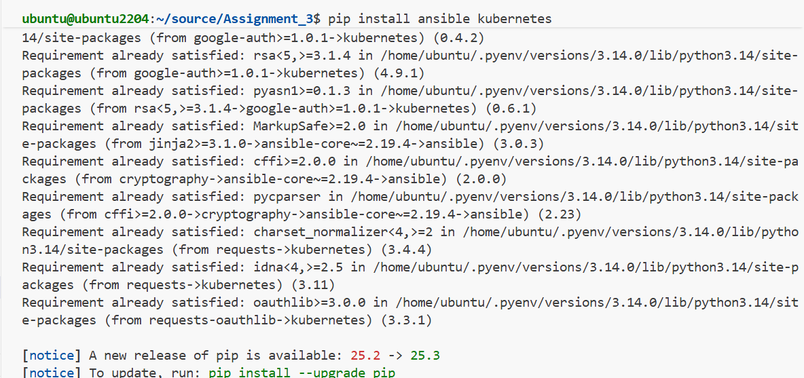
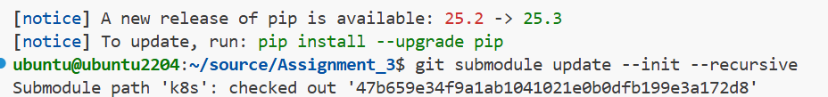
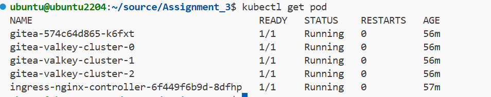
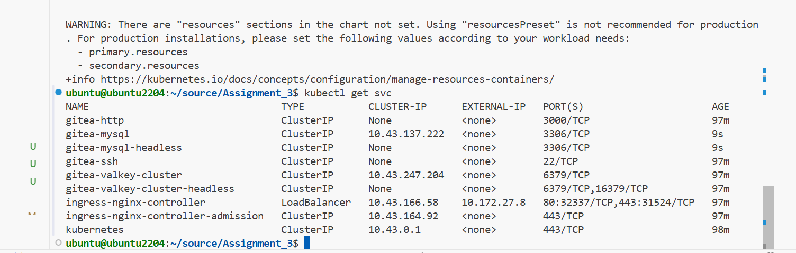

# cdevops-gitea
k8s gitea lab to take dev (sqlite based) to prod (mysql based)

TLDR;

```bash
pip install ansible kubernetes

git submodule update --init --recursive

ansible-playbook up.yml
```

Wait until `kubectl get pod` shows all pods running and:

```bash
kubectl port-forward svc/gitea-http 3000:3000
```
cloudflared tunnel list


Check your Cloudflare ID on the list and:

bash
cloudflared tunnel route dns <<CLOUDFLARE_ID>> <<HOST>>


Edit your config file to reflet your hosts list:

bash
sudo nano /etc/cloudflared/config.yml


This is how this config file looks like:

bash
tunnel: <<CLOUDFLARE_ID>>
credentials-file: /home/ubuntu/.cloudflared/<<CLOUDFLARE_ID>>.json 
ingress:
  - hostname: zafar0725.k3p.dev
    service: http://localhost:4180 # port oauth2-proxy is listening on
  - hostname: zafar0725.k3p.dev
    service: http://localhost:8080 # anything you run on this port will be accessible from the hostname ... use to smoke test
  - hostname: gitea.k3p.dev
    service: http://localhost  

  - service: http_status:404
  Restart the Cloudflared service:

bash
sudo systemctl restart cloudflared


Apply the ingress.yml file for Gitea:

bash
kubectl apply -f gitea/ingress.yml

Sanity check -> check if Kubernetes is reading the IP properly:

bash
kubectl get ingress

Should have something like this:
bash
NAME            CLASS   HOSTS       ADDRESS      PORTS   AGE
gitea-ingress   nginx   *           10.172.27.8  80      15m

Now you should be able to access gitea in development mode.



